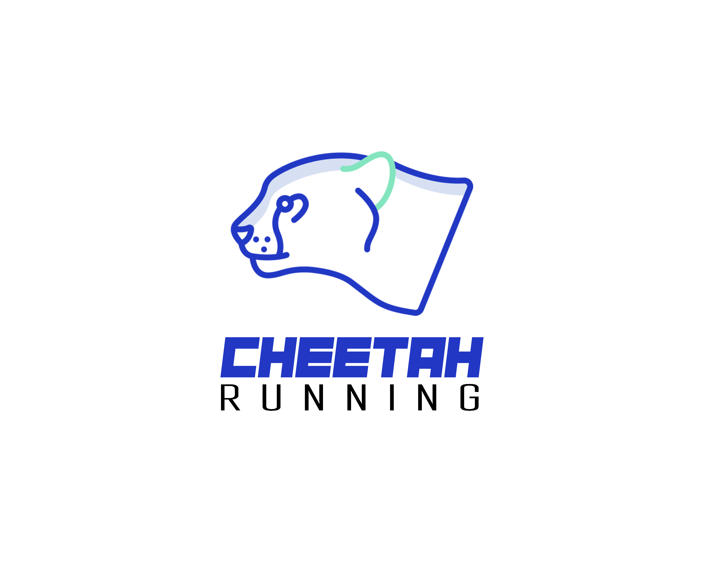
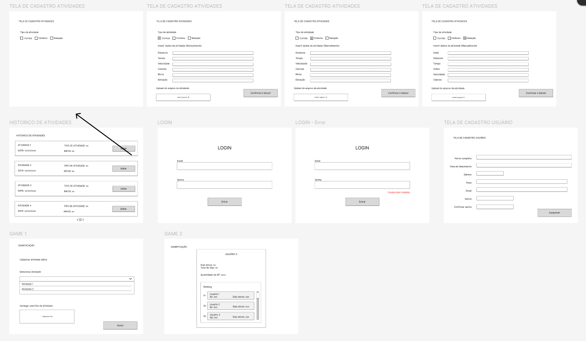

# Monitoramento de Atividades Físicas - MMAA

**Número do Grupo**: MMAA<br>
**Código da Disciplina**: 8002.1<br>



## Alunos
| Matrícula       | Aluno          |
| --------------- | -------------- |
| 202401000191    | Alex Cyrillo    |
| 202208385371    | André Costa     |
| 202307164186    | Marcelo Saggio  |
| 202208385192    | Michel Lutegar  |

## Sobre
Este projeto consiste em um software de **monitoramento de atividades físicas**, onde os usuários podem registrar e acompanhar suas atividades esportivas, como corrida e ciclismo. O sistema oferece funcionalidades avançadas, incluindo a **visualização de atividades anteriores**, a possibilidade de **visualizar as atividades dos amigos** e competir em um **ranking gamificado**.

Os usuários podem acessar suas métricas detalhadas, como distância, tempo e calorias queimadas, e acompanhar seu progresso ao longo do tempo. A plataforma ainda permite que os usuários interajam com seus amigos, promovendo a motivação e competição saudável, com base em um sistema de gamificação.

## Diferenciais
- Visualização das atividades dos amigos.
- Sistema de gamificação com ranking de competição.
- Relatórios detalhados de desempenho esportivo.

## Screenshots


## Instalação 
**Linguagens**: Python (Django)<br>
**Tecnologias**: Git, WhatsApp, ChatGPT, Canvas, Figma, PlantUML<br>

### Pré-requisitos
- Python 3.8 ou superior.
- Django Framework.
- Git instalado.

### Passo a passo para instalação:
1. Clone o repositório:
   ```bash
   git clone https://github.com/seu_usuario/seu_projeto.git
   ```
2. Navegue até a pasta do projeto:
   ```bash
   cd seu_projeto
   ```
...

## Uso 
...

- O usuário poderá se registrar, adicionar amigos, visualizar suas atividades e interagir com o sistema de gamificação.
- Para visualizar as atividades de amigos, navegue até a seção "Amigos" e escolha um perfil.

## Vídeo
...

## Outros 
Quaisquer outras informações sobre seu projeto podem ser descritas abaixo.
- Repositório de imagens: ./assets/
- Diagramas UML gerados com PlantUML.
- Protótipos de interface gerados com Figma.
