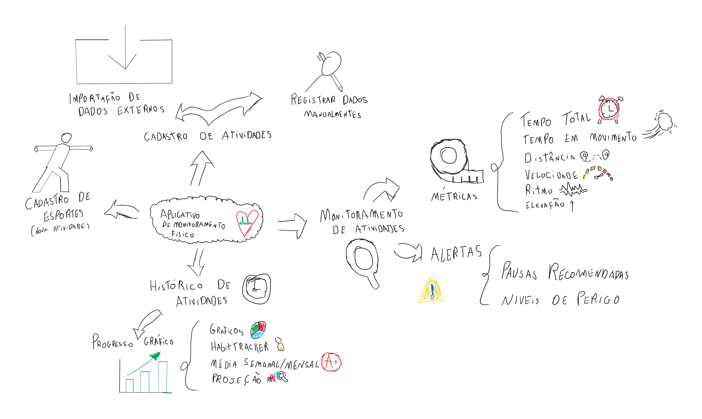

 
## Introdução
 

 O mapa mental é uma ferramenta visual que organiza informações complexas de forma simplificada, utilizando símbolos, cores, setas e frases-chave. Ele permite a criação de conexões visuais entre tópicos relacionados, facilitando a compreensão e retenção de informações. Essa metodologia é altamente recomendada para aprendizes que têm facilidade em absorver conteúdos de maneira visual. 
 
 Neste documento, foi elaborado um mapa mental para organizar as principais funcionalidades e características de um aplicativo de monitoramento de atividades físicas, abrangendo desde métricas monitoradas até funcionalidades de cadastro e histórico de atividades. 

 
## Metodologia
 

 A construção do mapa mental se deu a partir da identificação dos componentes essenciais para o desenvolvimento do aplicativo. Foram levantadas métricas como tempo, calorias queimadas, distância percorrida, além de funcionalidades como monitoramento, cadastro de atividades e esportes, e progresso gráfico. Esses elementos foram organizados visualmente para destacar as interconexões entre as funcionalidades e fornecer uma visão estratégica do sistema. 
 
 O processo incluiu tanto funcionalidades básicas, como monitoramento e registro de atividades, quanto diferenciais, como projeção gráfica e o uso de um habit tracker para manter a consistência do usuário nas atividades físicas. 

## Mapa mental - Geral.
 
## Versão 1.0
 
### Mapa mental
 

 Este mapa mental destaca as funcionalidades relacionadas ao histórico de atividades e à evolução do usuário. Ele aborda o registro de atividades manuais e automáticas, o cadastro de esportes específicos e o progresso gráfico, que inclui a visualização de hábitos, médias semanais e projeções de desempenho. 

## Versão 2.0

### Mapa mental

## Conclusão
 

 A criação do mapa mental permitiu uma visualização eficiente do escopo do aplicativo de monitoramento de atividades físicas. Com ele, foi possível organizar as funcionalidades essenciais e diferenciais do projeto, como a importação de dados e o monitoramento de métricas, de forma a garantir uma experiência de usuário fluida e personalizada. O uso de gráficos e relatórios ajuda o usuário a acompanhar seu progresso, enquanto a inclusão de um habit tracker promove a consistência nas atividades físicas. 

## Referências

> ChatGPT. Disponível em: https://chatgpt.com/
 
## Versionamento
| Data       | Versão | Descrição                | Autor(es)      |
|------------| -- |--------------------------|----------------|
| 04/09/2024 | 1.0 | Criação do documento     | Michel Lutegar |
| 04/09/2024   | 2.0 | Adicionado Mapa mental 1 | Michel Lutegar      |
| 04/09/2024   | 2.0 | Adicionado Mapa mental 2 | Michel Lutegar      |
