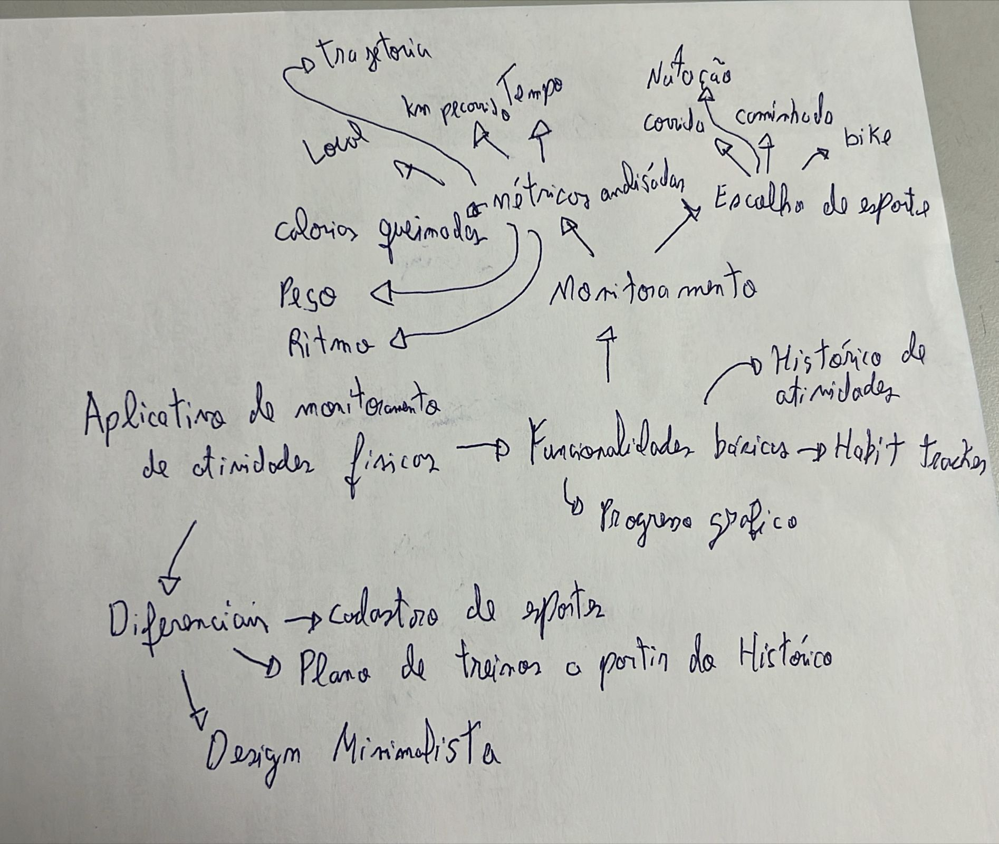

 
## Introdução
 

Mapa mental consiste em criar resumos cheios de símbolos, cores, setas e frases de efeito com o objetivo de organizar o conteúdo e facilitar associações entre as informações destacadas. Esse material é muito indicado para pessoas que têm facilidade de aprender de forma visual.

 
## Metodologia
 

 Inicialmente, foram levantados os principais pontos a serem incluídos no desenvolvimento do aplicativo. Entre eles, destacam-se as métricas a serem monitoradas, a interface de usuário e as funcionalidades diferenciais do sistema. O mapa mental foi elaborado manualmente, utilizando setas e conectores para mostrar a inter-relação entre diferentes funcionalidades e características do app, como monitoramento de atividades, histórico de dados e progresso gráfico. 
 
 O objetivo principal foi fornecer uma visão geral do funcionamento do aplicativo, desde as métricas monitoradas (como calorias queimadas, tempo de atividade, distância percorrida) até funcionalidades adicionais, como a criação de planos de treino personalizados com base no histórico de uso. 

 
## Mapa mental - Geral.
 
## Versão 1.0
 
### Mapa mental 1
 

## Conclusão
 

 O uso do mapa mental permitiu uma visão clara e organizada do desenvolvimento do aplicativo de monitoramento de atividades físicas. Ele facilitou o agrupamento de informações complexas, proporcionando uma estrutura lógica e prática para a implementação das funcionalidades principais. Além disso, foi possível destacar diferenciais e pontos de personalização que agregarão valor à experiência dos usuários. 

 
## Referências

> ChatGPT. Disponível em: https://chatgpt.com/

 
## Versionamento
| Data       | Versão | Descrição                | Autor(es)      |
|------------| -- |--------------------------|----------------|
| 04/09/2024 | 1.0 | Criação do documento     | Michel Lutegar |
| 04/09/2024   | 2.0 | Adicionado Mapa mental 1 | Michel Lutegar      |
